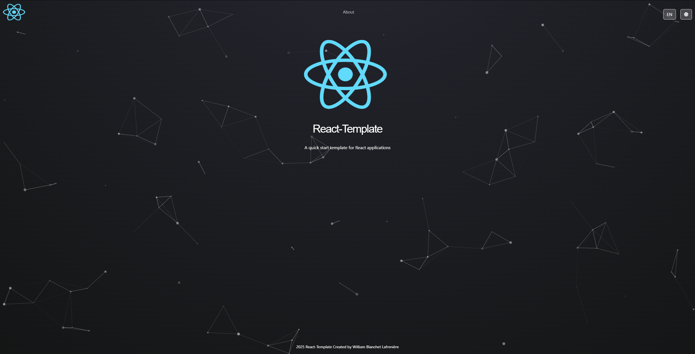

# React Template



## Description

Cette application est un modèle d'application react avec react-bootstrap.

## Fonctionnalités

- Application de démarrage avec une page d'accueil, une page à propos et une page pour les urls non trouvés
- Thème sombre et clair basculable sur toutes les pages
- Deux langages supportés (Français et Anglais)
- Particules personnalisées présentes sur les pages
- Animations basique de pages
- Barre de navigation et pied de page

## Installation

1. Clonez ce dépôt sur votre machine locale :

```bash
git clone https://github.com/votre-utilisateur/react-template.git
```

2. Accédez au répertoire du projet :

```bash
cd react-template
```

3. Installez les dépendances du projet :

```bash
npm install
```

4. Exécutez l'application en mode développement :

```bash
npm run dev
```

5. Ouvrez votre navigateur et accédez à l'application à l'adresse
   suivante : [http://localhost:8080](http://localhost:8080)

## Technologies utilisées

- [React](https://reactjs.org/)
- [Next.js](https://nextjs.org/)
- [React Router](https://reactrouter.com/)
- [TypeScript](https://www.typescriptlang.org/)
- [Bootstrap](https://getbootstrap.com/)
- [React-Bootstrap](https://www.react-bootstrap.cn)
- [Particules animées](https://github.com/matteobruni/tsparticles)
- [FontAwesome](https://fontawesome.com/)
- [Framer Motion](https://motion.dev)

## Auteur

William Blanchet Lafrenière

Ne pas reproduire et/ou distribuer ce projet sans l'autorisation de l'auteur.

---

# React Template


## Description

This application is a React template using React-Bootstrap.

## Features

- Starter application with a home page, an about page, and a page for not found URLs
- Toggleable dark and light theme across all pages
- Two supported languages (French and English)
- Custom particles displayed on pages
- Basic page animations
- Navigation bar and footer

## Installation

1. Clone this repository to your local machine:

```bash
git clone https://github.com/your-username/react-template.git
```

2. Navigate to the project directory:

```bash
cd react-template
```

3. Install the project dependencies:

```bash
npm install
```

4. Run the application in development mode:

```bash
npm run dev
```

5. Open your browser and go to the application at the following address:
   [http://localhost:8080](http://localhost:8080)

## Technologies Used

- [React](https://reactjs.org/)
- [Next.js](https://nextjs.org/)
- [React Router](https://reactrouter.com/)
- [TypeScript](https://www.typescriptlang.org/)
- [Bootstrap](https://getbootstrap.com/)
- [React-Bootstrap](https://www.react-bootstrap.cn)
- [Animated Particles](https://github.com/matteobruni/tsparticles)
- [FontAwesome](https://fontawesome.com/)
- [Framer Motion](https://motion.dev)

## Author

William Blanchet Lafrenière

Do not reproduce and/or distribute this project without the author's permission.
